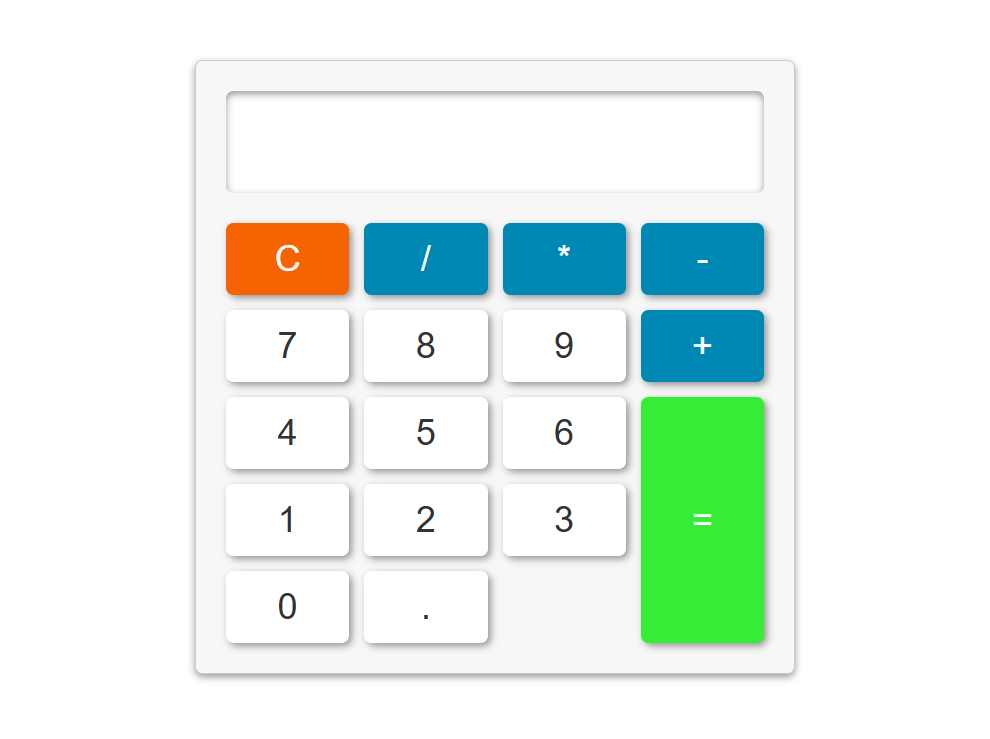

# 🧮 Calculator

A basic, fully working calculator built with HTML, CSS, and vanilla JavaScript. Click the buttons to build an expression, then hit `=` to evaluate it — or `C` to clear and start over.


🔗 **Live Demo:** [https://shena9y.github.io/Calculator/](https://shena9y.github.io/Calculator/)

## ✨ Features

- 🔢 Full digit pad and arithmetic operators
- 🟰 **Evaluate** button computes the current expression
- 🧹 **Clear (C)** button resets the display
- 🖱️ Event-driven button handling across all keys
- ⚡ No frameworks or dependencies

## 🛠️ Tech Stack

- HTML5
- CSS3
- Vanilla JavaScript (DOM events & expression evaluation)

## 📂 Project Structure

```
Calculator/
├── index.html       # Calculator layout (display + buttons)
├── master.css       # Styling for the calculator
├── main.js          # Button handling & calculation logic
└── screenshot.png   # App screenshot
```

## 🚀 Getting Started

**Try it live:** [https://shena9y.github.io/Calculator/](https://shena9y.github.io/Calculator/) — no installation needed!

1. Clone the repository
   ```bash
   git clone https://github.com/shena9y/Calculator.git
   ```
2. Open `index.html` in your browser.
3. Click the buttons to enter an expression and press `=` for the result.

## 📸 Screenshot



🔗 **Live Demo:** [https://shena9y.github.io/Calculator/](https://shena9y.github.io/Calculator/)

## 📝 License

This project is open source and available under the [MIT License](LICENSE).

